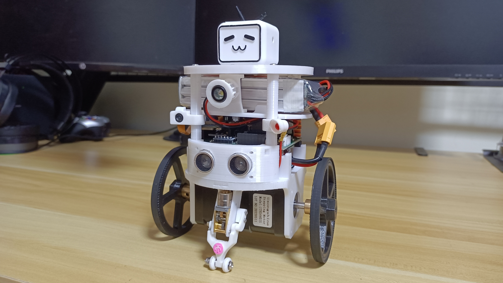

# NodeBalance V1
Stepper motor balancing robot project using NodeMCU32S and ESP32CAM coding with C++.   

# More Details
will soon...   

# Reference   
* [esp32 wifi balancing robot](https://github.com/bluino/esp32_wifi_balancing_robot) by bluino.   
* [esp32 audio](https://github.com/atomic14/esp32_audio) repository by atomic14.

## Demonstration (Video)
[Bilibili: B站蠢萌平衡小车](https://www.bilibili.com/video/BV1oS4y1n7FK/)   
